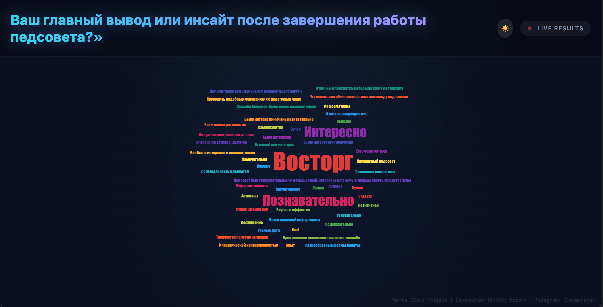
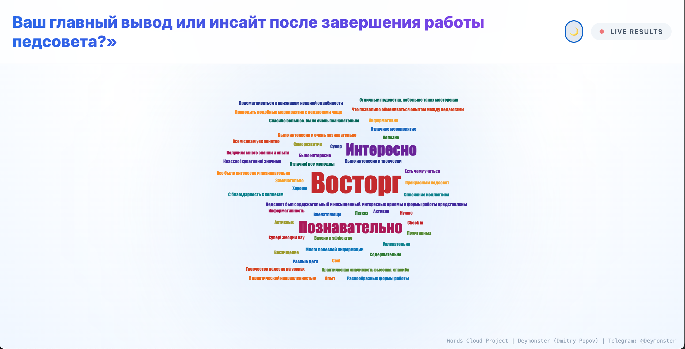
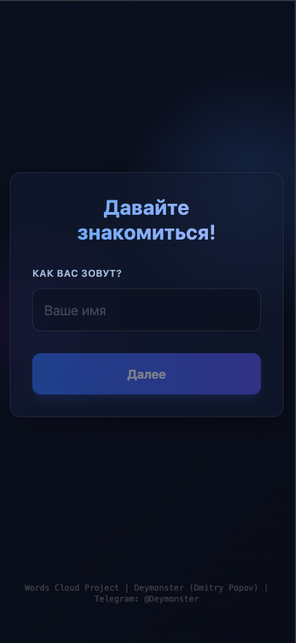
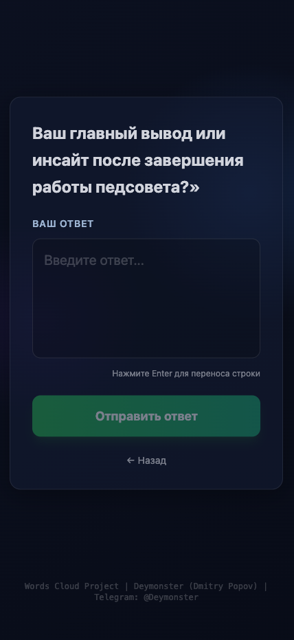
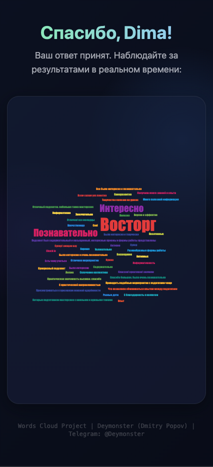
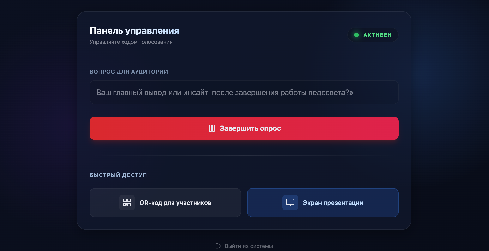

# ☁️ Real-time Word Cloud Service

> Интерактивный сервис для создания живого облака слов. Идеален для конференций, лекций и митапов.


## 📖 О проекте

Этот сервис позволяет аудитории отвечать на вопросы спикера в реальном времени через смартфоны. Ответы мгновенно появляются на большом экране в виде красивого, динамически обновляемого облака слов.

### ✨ Ключевые возможности

*   **⚡ Реактивность:** Используется технология Server-Sent Events (SSE) для мгновенного обновления экрана без перезагрузки.
*   **🎨 Визуализация:** Слова автоматически распределяются, меняют размер и цвет в зависимости от частоты упоминания.
*   **🌗 Темы оформления:** Светлая и темная темы для адаптации под освещение зала (переключатель прямо на экране презентации).
*   **🛡 Умная модерация:** Фильтрация базовой нецензурной лексики и стоп-слов.
*   **📱 Mobile First:** Удобный интерфейс для участников на любых смартфонах.
*   **🛠 Админ-панель:** Полный контроль над опросом (старт, стоп, сброс, генерация QR-кода).

---

## 📸 Скриншоты

### Экран презентации (Темная / Светлая тема)
<div style="display: flex; gap: 10px;">
  
  
</div>

### Интерфейс участника
<div align="center">
  
</div>

<div align="center">
  
</div>

<div align="center">
  
</div>

### Админ-панель



---

## 🛠 Технологический стек

| Категория | Технологии |
|-----------|------------|
| **Frontend / Backend** | Next.js 16 (App Router), React, TypeScript |
| **Database** | SQLite + Prisma ORM |
| **Real-time** | Native EventSource (SSE) |
| **Styling** | Tailwind CSS + Glassmorphism UI |
| **Visualization** | D3-cloud |
| **Infrastructure** | Docker, Docker Compose |

---

## 🚀 Быстрый старт (Docker Production)

Самый простой способ запустить сервис на своем сервере.

### 1. Подготовка сервера
Приложение работает от пользователя `nextjs` (UID 1001), поэтому нужно заранее создать папку для БД и выдать права:

```bash
mkdir -p prisma/data
sudo chown -R 1001:1001 prisma
```

### 2. Запуск
Создайте файл `.env` (возьмите пример из `.env.prod.example`) и `docker-compose.prod.yml`, затем запустите:

```bash
docker compose -f docker-compose.prod.yml up -d
```

Сервис будет доступен на порту `3000`.

---

## 💻 Локальная разработка

**Требования:** Node.js 20+ (рекомендуется 22).

1.  **Установка зависимостей:**
    ```bash
    npm install
    ```
2.  **Инициализация БД:**
    ```bash
    npx prisma migrate dev --name init
    ```
3.  **Запуск:**
    ```bash
    npm run dev
    ```
4.  **Ссылки:**
    *   Админка: [http://localhost:3000/admin](http://localhost:3000/admin) (Ключ: `admin123`)
    *   Презентация: [http://localhost:3000/presentation](http://localhost:3000/presentation)
    *   Опрос: [http://localhost:3000/survey](http://localhost:3000/survey)

---

## 🧪 Тестирование

*   **Unit тесты:** `npm test`
*   **Seed (заполнение данными):** `npx prisma db seed`
*   **Визуальный тест:** `npx tsx scripts/visual-test.ts` (запустите в отдельном терминале и смотрите на экран презентации).

---

## 👤 Автор

**Dmitry Popov (Deymonster)**
*   Telegram: [@Deymonster](https://t.me/Deymonster)
